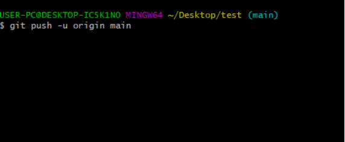
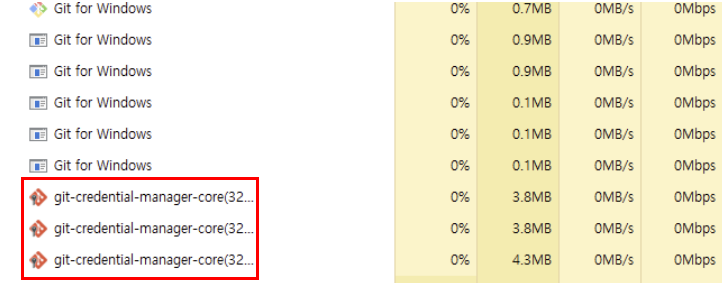

## **발생이슈**



- git push를 하면 아무 일도 일어나지 않고 진행되지 않는 현상

- 현재 2.3.2 버전의 git credential manager가 에러가 있기 때문에 발생한 이슈

---

## **해결책**

- CTRL + ALT + DELETE 누르셔서 작업 관리자로 이동 후에 쭉  git-credential-manager-core 프로세스가 떠있을 강제로 작업 종료 누르면 로그인 창이 나옴



---

## **해결책 2**

[git-2.30.2.windows](http://git-2.30.2.windows) 버전으로 재설치

---

## **해결책 3**

github의 레포지토리는 권한이 있는 사용자만 push 할 수 있습니다. 따라서 로그인을 해줘야하는데요. 로그인을 하는 프로그램이 여러개 있는데, 그걸 변경하는 명령어 입니다.

```python
git config --global credential.git.example.com.provider generic
```

---

