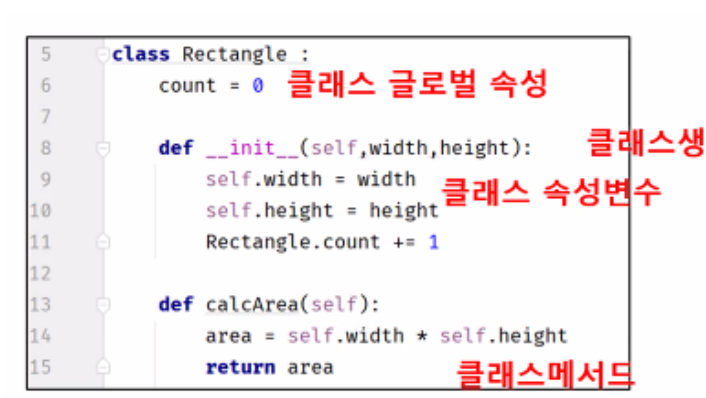
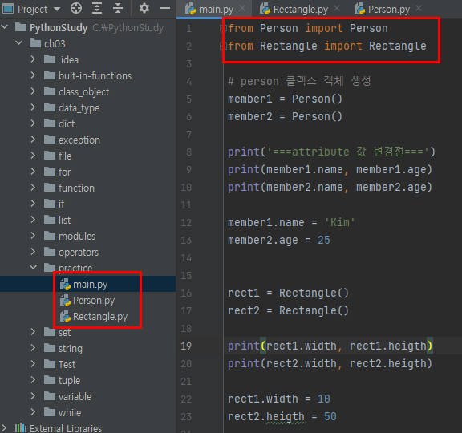
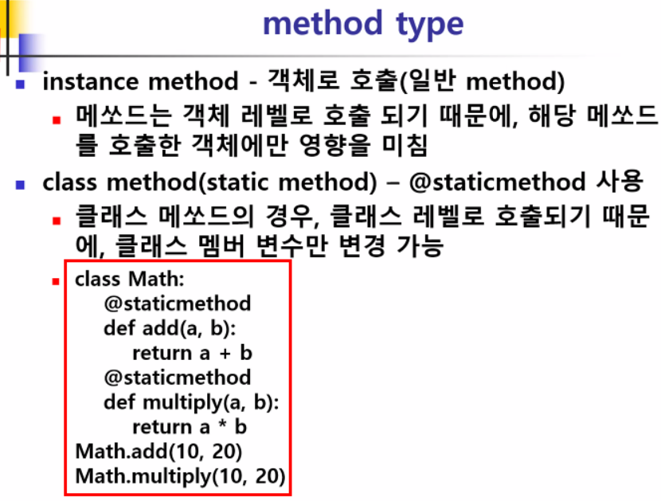

## 객체 지향 프로그래밍

- 객체(object)의 상태(state)와 행동(behavior)을 구체화하는 형태의 프로그래밍
- 모든 데이터를 객체(object)로 취급
  - 객체가 바로 프로그래밍의 중심
- 객체는 여러 가지 속성을 가질 수 있는 대상 쉽게 말하면 우리가 인식할 수 있는 사물(사람, 자동차, 핸드폰 등)
- 객체를 만들어 내기 위한 설계도와 같은 개념을 클래스(class)라고 함

---

## Class

- 데이터(변수)와 데이터를 다루는 연산(함수)를 하나로 캡슐화(encapsulation)하여 표현한 것이 클래스(class)
- 객체를 효율적으로 생성하기 위해 만들어진 구문
- Python에서 string, int, list, dict... 모두가 클래스가 존재

---

## Method

- 클래스 안에 선언된 함수

---

## 인스턴스

- 클래스를 기반으로 생성한 객체를 의미

---

## 생성자

- 인스턴스를 생성하면 문조건 호출되는 메서드

---

## 예시

~~~python
## 클래스 선언 부분 ##
class Car:
    color = ""
    speed = 0

    def upSpeed(self, value): #매서드
        self.speed += value

    def downSpeed(self, value): #매서드
        self.speed -= value


## 메인 코드 부분 ##
myCar1 = Car() #인스턴스
myCar1.color = "빨강"
myCar1.speed = 0

myCar2 = Car() #인스턴스
myCar2.color = "파랑"
myCar2.speed = 0

myCar3 = Car() #인스턴스
myCar3.color = "노랑"
myCar3.speed = 0

myCar1.upSpeed(30)
print("자동차1의 색상은 %s이며, 현재 속도는 %dkm입니다." % (myCar1.color, myCar1.speed))

myCar2.upSpeed(60)
print("자동차2의 색상은 %s이며, 현재 속도는 %dkm입니다." % (myCar2.color, myCar2.speed))

myCar3.upSpeed(0)
print("자동차3의 색상은 %s이며, 현재 속도는 %dkm입니다." % (myCar3.color, myCar3.speed))

~~~

---

## class 선언



---

## Object

- 클래스로 생성되어 구체화된 객체(인스턴스)
- int, str, list.... 등이 객체
- 실제로 class가 인스턴스화 되어 메모리에 상주하고 있는 상태

---

## Instance

- 선언된 해당 클래스 타입의 객체가 인스턴스
- 메모리에 할당된 객체를 의미
- 하나의 클래스로 부터 여러 개의 인스턴스 생성 가능
  - list1 = [1,2,3], list2 = [4,5,6]
- 생성된 인스턴스는 독립된 메모리 공간에 저장된 자신만의 필드를 가짐

---

## class 선언

- 동일한 경로에 파일을 생성해서 Person, Rectangle 클래스 선언

  

  ```python
  class Person:
      def __init__(self):
          self.name = 'Kate'
          self.age = 10
          print(self, 'is generated')
  ```

   ```python
   class Rectangle: # width, height 라는 2개 속성을 정의 - 기본값 지정
       def __init__(self):
           self.width = 1
           self.heigth = 1
   
   ```

  ```python
  from Person import Person
  from Rectangle import Rectangle
  
  # person 클랙스 객체 생성
  member1 = Person() #인스턴스
  member2 = Person()
  
  print('===attribute 값 변경전===')
  print(member1.name, member1.age)
  print(member2.name, member2.age)
  
  member1.name = 'Kim'
  member2.age = 25
  
  
  rect1 = Rectangle()
  rect2 = Rectangle()
  
  print(rect1.width, rect1.heigth)
  print(rect2.width, rect2.heigth)
  
  rect1.width = 10
  rect2.heigth = 50
  
  
  print('===attribute 값 변경후===')
  print(member1.name, member1.age)
  print(member2.name, member2.age)
  print(rect1.width, rect1.heigth)
  print(rect2.width, rect2.heigth)
  ```

  

## 생성자 구현

```python
class Person:
    def __init__(self, name, gender, age=10):
        self.name = name
        self.gender = gender
        self.age = age

    def get_gender(self):
        print(self.gender)

    def add_age(self, add):
        return self.age + add

if __name__ == '__main__':

    p1 = Person('다영', 'w', 23)
    p2 = Person('진주', 'w')
    p3 = Person('비스켓', 'm', 50)

    p1.get_gender()
    temp = p1.add_age(20)
    print(temp)
    
    temp = p2.add_age(20)
    print(temp)
```

---

## 클래스 선언 후 매서드 활용

```python
class Person:
    def __init__(self, name, age=10):
        self.name = name
        self.age = age
        print(self, 'is generated')

    def sleep(self):
        print('self : ', self)
        print(self.name, '은 잠을 잡니다.')


class Rectangle:
    def __init__(self, width, height):
        self.width = width
        self.height = height

    def calcArea(self):
        area = self.width * self.height
        return area


        #클래스 매서드 (넓이) calcArea

### 객체 인스턴스 사용

a = Person('Aaron', 20)
b = Person('Bob', 30)

a.sleep()
b.sleep()

r_1 = Rectangle(10, 30)
r_2 = Rectangle(3.5, 5.3)

print('면적 r_1 : ', r_1.calcArea())
print('면적 r_2 : ', r_2.calcArea())
```

---

## 클래스 활용 이유

- 서로 다른 데이터 저장 공간을 가지면 동일한 함수를 사용할 수 있어서

---

## method type

- instance method
  - 매소드는 객체 레벨로 호출 되기 때문에, 해당 매소드를 호출한 객체에만 영향을 줌
- class method (static method) - @staticmethod 사용
  - 객체를 생성하지 않고 클랙스 접근에서 사용하는 경우 (인스턴스 작업이 필요하지 않음)



~~~python
class Math:
    @staticmethod
    def add(a, b):
        return a+b

    @staticmethod
    def multiply(a, b):
        return a*b


print('클래스 메서드로 접근 : ', Math.add(10, 20))
print('클래스 메서드로 접근 : ', Math.multiply(10, 20))

m_obj = Math()
print('객체(인스탄스) 메서드로 접근 : ', m_obj.add(3,4))
print('객체(인스탄스) 메서드로 접근 : ', m_obj.multiply(3,4))
~~~


## Class Inheritance (상속)

- 기존에 정의한 클래스 의 기능을 그대로 물려받을 수 있는 기능
- 기존 클래스에 추가 및 변경해서 새로운 클래스로 정의
- 코드 재사용 가능
- 상속 받고자 하는 클래스 (Parent, Super, Bass) 
- 상속 받는 새로운 클래스 (Child, Sub, Derived)
- 부모 클래스에서 특정 부분 수정해서 사용 가능하면 필요 따라 부모 클래스 요소를  다시 사용 가능
- 하위 클래스에 상속한 클래스를 재정의 하는 것을 매서드 오버라이딩

~~~python
# 07_class_inheritance.py

# super/부모/base 클래스
class Person:
    #생성자 함수
    def __init__(self, name, age):
        self.name = name
        self.age = age

    def eat(self, food):
        print('부모 : {}은 {}를 먹습니다.'.format(self.name, food))

    def sleep(self, minute):
        print('부모 : {}은 {}분동안 잡니다'.format(self.name,minute))

    def work(self, minute):
        print('부모 : {}은 {}분동안 일합니다'.format(self.name, minute))

# 상속 :  class 클래스명(부모클래스명)

#child 클래스 생성(Student, Employee)
class Student(Person):
    def __init__(self, name, age):
        self.name = name
        self.age = age

# 하위 클래스에서 부모 클래스가 갖고 있는 함수(메서드)를 재 정의 하는 것 - 매서드 오버라이딩
    def work(self, minute):
        print('자식 : {}은 {}분동안 강의를 듣습니다'.format(self.name, minute))

class Employee(Person):
    def __init__(self, name, age):
        self.name = name
        self.age = age


bob = Employee('Bob', 25)
bob.eat('BBQ')
bob.sleep(30)
bob.work(60)
print('///////////////////////////////////')
lee = Student('Lee', 19)
lee.eat('NOODLE')
lee.sleep(60)
lee.work(30)
~~~

- 자식 클래스에서 부모 클래스 호출 방법

```python
# 하위 클래스에서 상위 클래스 호출
class Person:
    #생성자 함수
    def __init__(self, name, age):
        self.name = name
        self.age = age

    def eat(self, food):
        print('부모 : {}은 {}를 먹습니다.'.format(self.name, food))

    def sleep(self, minute):
        print('부모 : {}은 {}분동안 잡니다'.format(self.name,minute))

    def work(self, minute):
        print('부모 : {}은 {}분동안 일합니다'.format(self.name, minute))

# 상속 :  class 클래스명(부모클래스명)

#child 클래스 생성(Student, Employee)
class Student(Person):
    def __init__(self, name, age):
        self.name = name
        self.age = age

# 하위 클래스에서 부모 클래스가 갖고 있는 함수(메서드)를 재 정의 하는 것 - 메서드 오러라이드
    def work(self, minute):
        super().work(minute) #부모클래스 호출
        print('자식 : {}은 {}분동안 강의를 듣습니다'.format(self.name, minute))

class Employee(Person):
    def __init__(self, name, age):
        self.name = name
        self.age = age


bob = Employee('Bob', 25)
bob.eat('BBQ')
bob.sleep(30)
bob.work(60)
print('///////////////////////////////////')
lee = Student('Lee', 19)
lee.eat('NOODLE')
lee.sleep(60)
lee.work(30)

```

---


