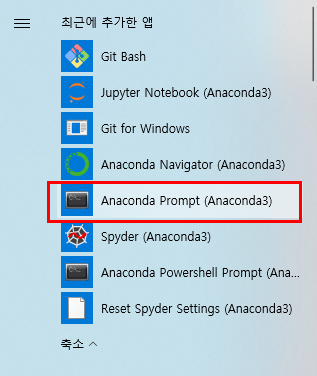
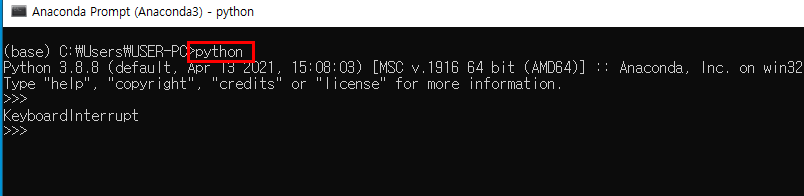
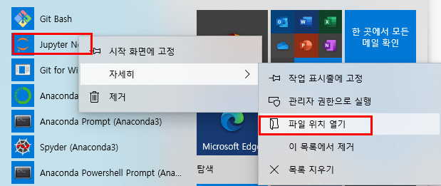
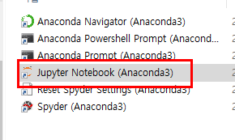
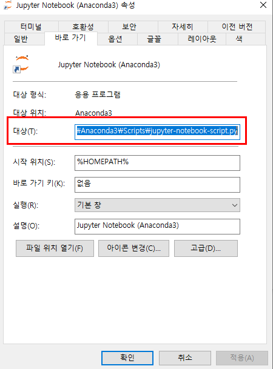
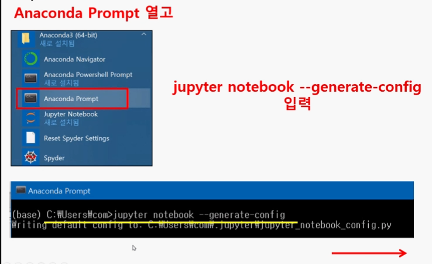
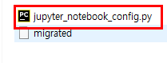
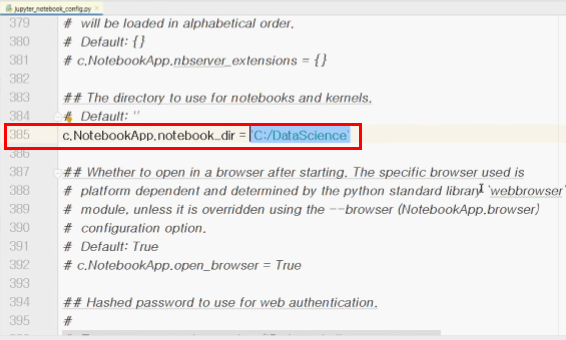

##  Jupyter 설치 및 기본 경로 작업

- 아나콘다를 설치하면 Python 및 Jupyter 자동 설치
  - [아나콘 설치](https://www.anaconda.com/)
- 경로와 관련된 모든 항목 체크 후 설치 
- [Anaconda Prompt] 에서 파이썬 연결 확인

- Jupyter 속성 열기

  

  

- [대상(T)]에서 ``"%USEUPROFILE%"`` 내용 삭제

  

- [Anaconda Prompt]에서 그림에 있는 명령어 입력

-  사용자 폴더 밑에 [.JUPYER] 폴에 존재 하는 [jupyter_notebook_config.py] 파일 수정
  - 385 라인에 주석처리 제거 후 경로 수정 ('C:/DataScience')

---

## Jupyter 사용법

- 크롬을 기본 웹브라운저로 선택

- 쥬피터 실행

  

