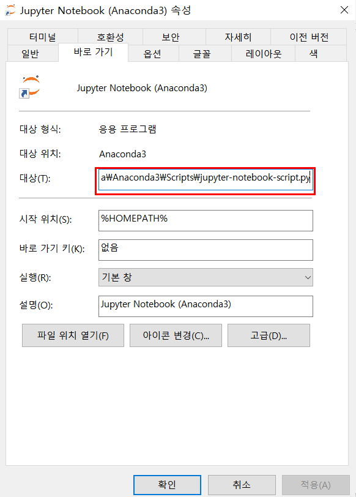
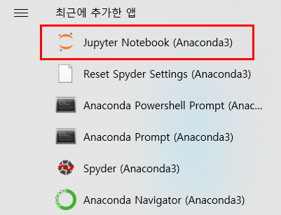

##  Jupyter 설치 방법

- 아나콘다를 설치하면 Python 및 Jupyter 자동 설치
  - [아나콘 설치](https://www.anaconda.com/)

- 경로와 관련된 모든 항목 체크 후 설치 

---

## Jupyter 사용법

- 크롬을 기본 웹브라운저로 선택

- 쥬피터 경로에 가서 .py 이하 적혀있는 부분 삭제

- Python 파일에 열고 경로 수정 후 저장하는 작업 필요 (ex C:\DataScience)

- 쥬피터 실행

  

