## 통계 기본 용어

- 모집단 (population)
  - 조사 대상이 되는 관측 가능한 개ㅐ체로 된 집단 전체

- 표본 (sample)
  - 모집단에서 선택된 모집단 구성 단위의 일부

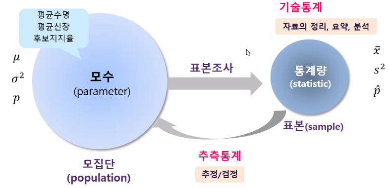

- 전수 조사
  - 모집단 전체를 조사

- 표본 조사
  - 모집단의 일부를 조사

- 모수 (parameter)
  - 모집단의 특성을 나타내는 수치

- 통계량 (sample statistic)
  - 표본의 특성을 나타내는 수치

- 기술통계와 추측통계

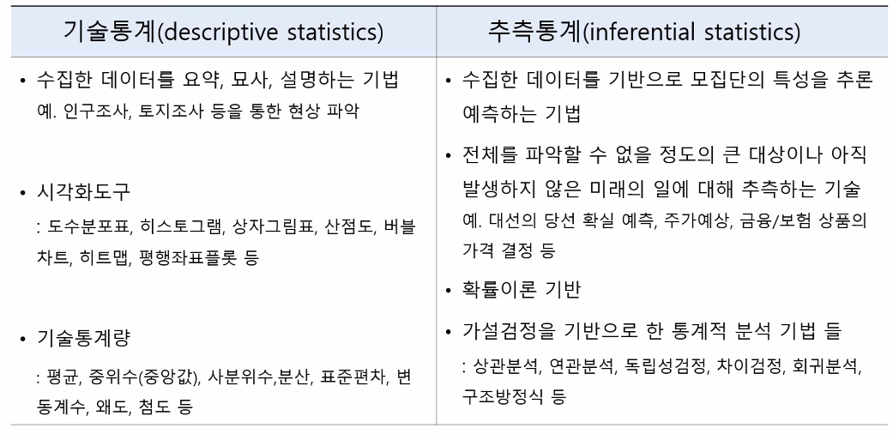

---

## 데이터와 변수

- 데이터
  - 가치 판단의 근거가 될 수 있는 것
  - 현실 세계로 부터의 단순한 관찰이나 측정을 통해 수집된 사실이나 값
  - 대상물 또는 사항
  - raw data : 가공되지 않는 상태
  - 분석의 원자재

- data set
  - 관찰 대상으로 부터 속성들을 측정한 자료들의 모임

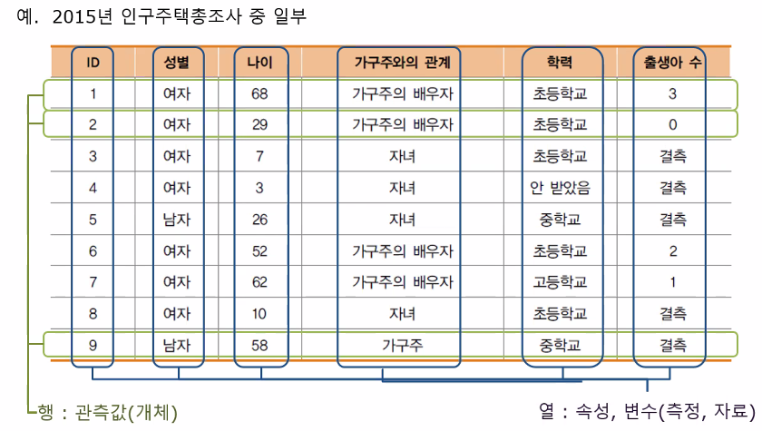

- 변수
  - 특정 조건에 따라 변하는 값
  - X변수와 Y변수 존재

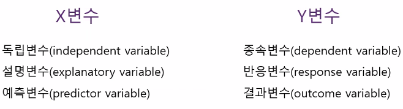

- 정성적 데이터와 정량적 데이터
  - 둘다 가공하지 않은 상태라서 raw data

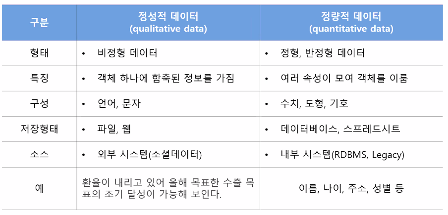

- 데이터 분류

  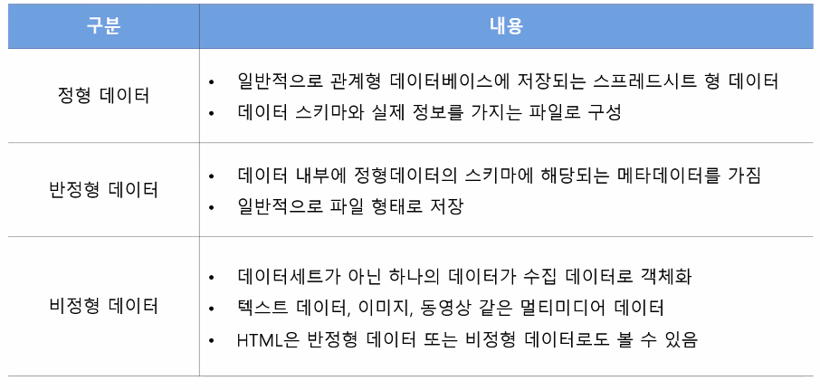

- 분석을 위한 데이터 유형

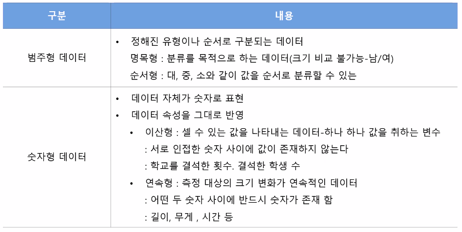

---

## 척도

- 척도 (scale)
  - 데이터를 측정하기 위해 임의로 부여한 숫자 간의 관계

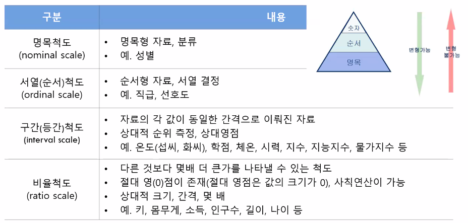

---

## 확률 변수

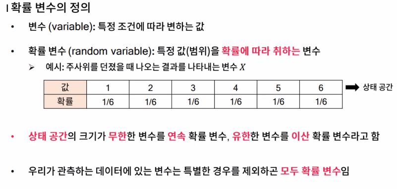

---

## 확률 분포 

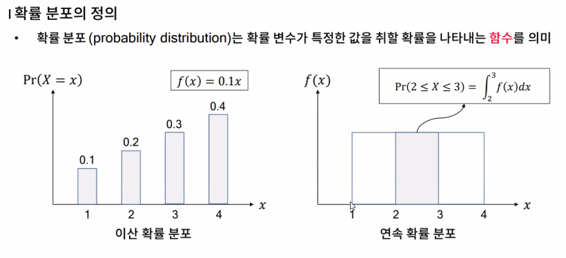

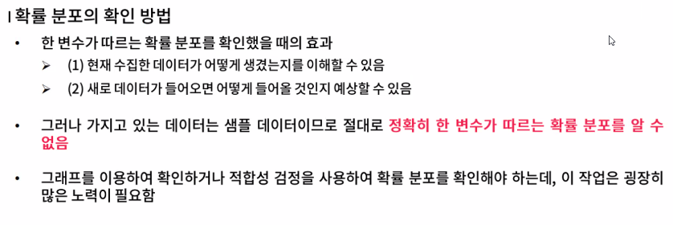

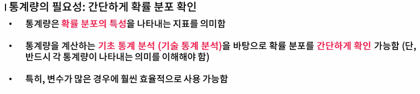

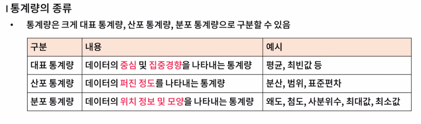

