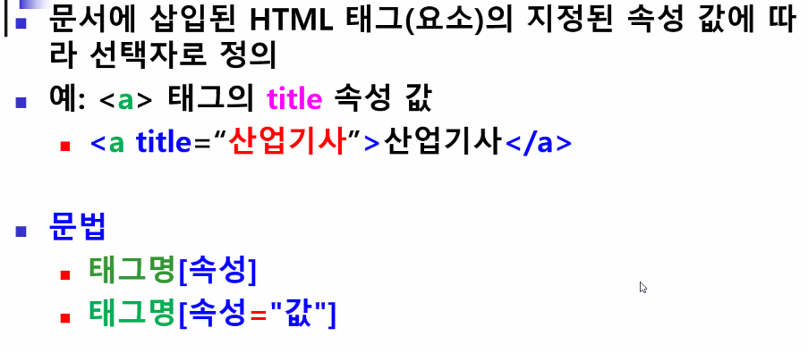

## 스타일 시트 (CSS)

- Cascading Style Sheets (계단형 스타일 시트)
- 단계적으로 스타일 적용
- 여러 스타일이 겹치면 맨 마지막 스타일이 적용됨

## 스타일 시트 장점

- 자유롭게 웹 문서 편집
- 통일감 있는 문서 작성
- 편리한 문서 관리

## 스타일 시트 적용 방법

- 문서 내부에서 정의 (Embedded Style)
- 외부 문서에서 연결 (Linked Style)
- 태그에 직접 정의 (Inline Style)

## 스타일 시트의 기본 형식

- 선택자 (selector)
  - 태그/클래스/아이디/속성/상태 선택자가 존재
- {속성:값}

## 태그 

~~~html
<!doctype html>
<html>
    <head>
        <meta charset="UTF-8">
        <title>태그 선택자</title>  
        
	</head>

	<body>
		<h1>태그 선택자 사용하기</h1>
		

		<h2>두부감자조림</h2> 
		<h3>재료</h3>
		<ul>
			<li>감자 1개</li>
			<li>두부 1/2모</li>
			<li>꽈리고추 10개</li>
			<li>홍고추 1개</li>
		</ul>
		<h3>조리법</h3>
		<ol>
			<li>감자는 껍질을 벗기고 돌려가면서 어슷하게 썰어 찬물에 담가놓고 두부는 도톰하게 한입크기로 썰며 꽈리고추, 홍고추는 어슷썬다.</li>
			<li>첫번째 썰은 재료에 두부를 팬에 기름을 두르고 노릇노릇하게 앞뒤로 지져 기름은 뺀다. </li>
			<li>냄비에 감자와 홍고추를 담고 조림장을 반분량만 넣는다. </li>
			<li>3번째를 끓이다가 감자가 반정도 익으면, 두부와 남은 양념장을 넣는다. </li>
			<li>윤기나게 졸여지면 꽈리고추를 마지막에 넣어 다시한번 살짝 졸여 조린다.</li>
		</ol>
	</body>
</html>

~~~

## 클래스 선택자

## 아이디 선택자

##  속성 선택자

## 상태 선택자

