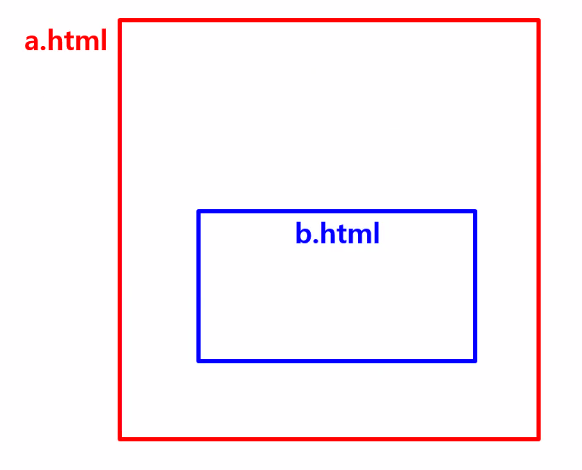
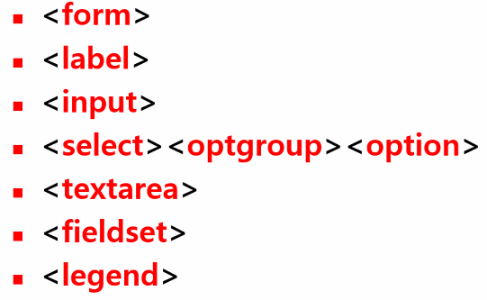
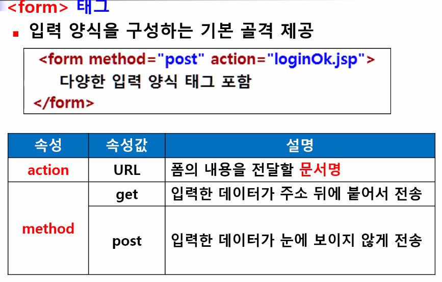
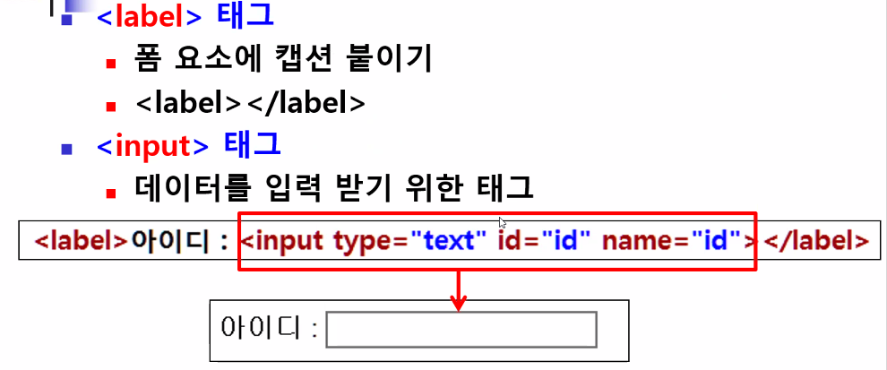
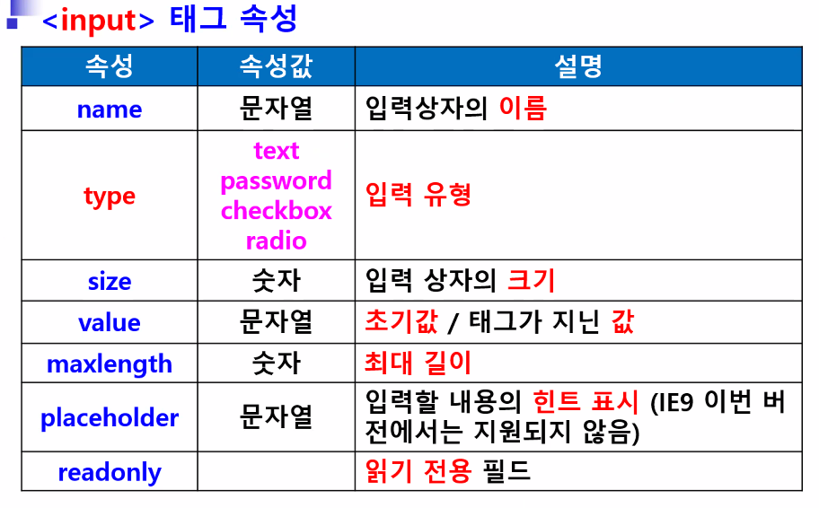
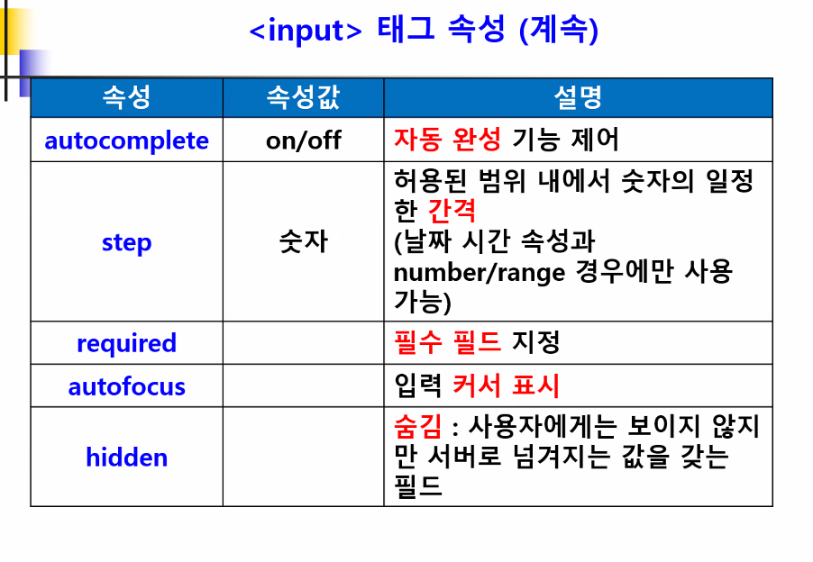
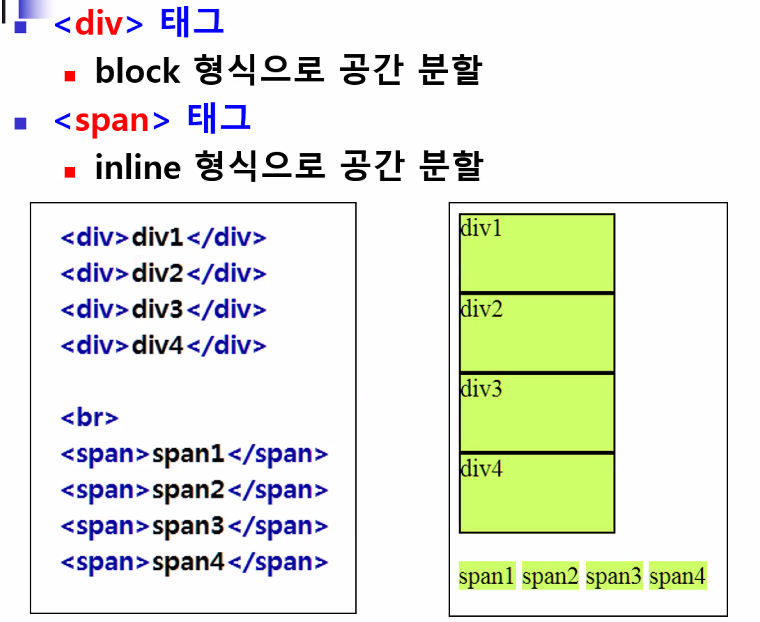
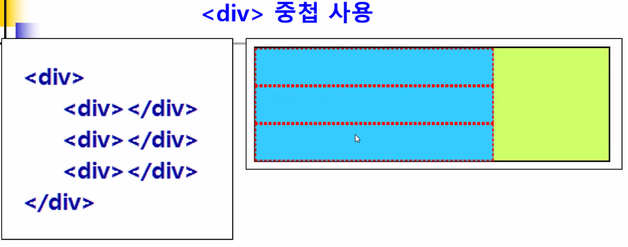

## frame 태그

- 현재 html 문서 내에 다른 문서 포함

~~~html
<!DOCTYPE html>
<html lang="en">
<head>
    <meta charset="UTF-8">
    <title>ifrmae</title>
    

</head>
<body>

    

        
        <map name="cityMap">
        <area shape="rect" coords="60,90,250,150" href="뉴욕.html" target="iFrameArea">
        <area shape="rect" coords="310, 90, 500, 150"  href="파리.html" target="iFrameArea">
        <area shape="rect" coords="560, 90, 750, 150"  href="로마.html" target="iFrameArea">
        <area shape="rect" coords="810, 90, 1000, 150"  href="베이징.html"target="iFrameArea">
        </map>

    

    

        <iframe name="iFrameArea"></iframe>
    

</body>
</html>
~~~

## 입력 양식 태그

- 입력 양식을 만들 때 사용하는 태그
- 클라이언트가 서버측에 정보 전달 가능

- 입력 양식 태그 종류

- label 태크는 알림 역할

## 공간 분할 태그

