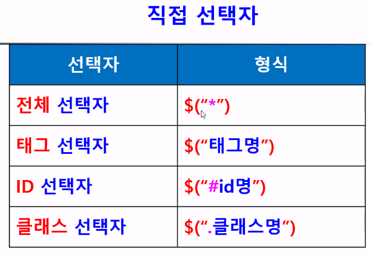
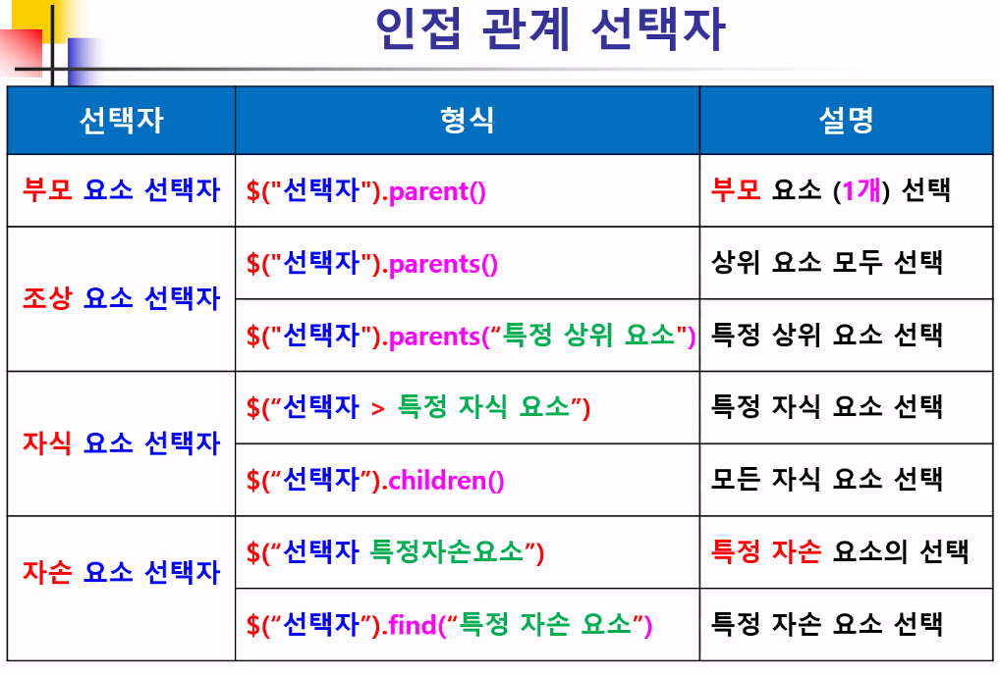
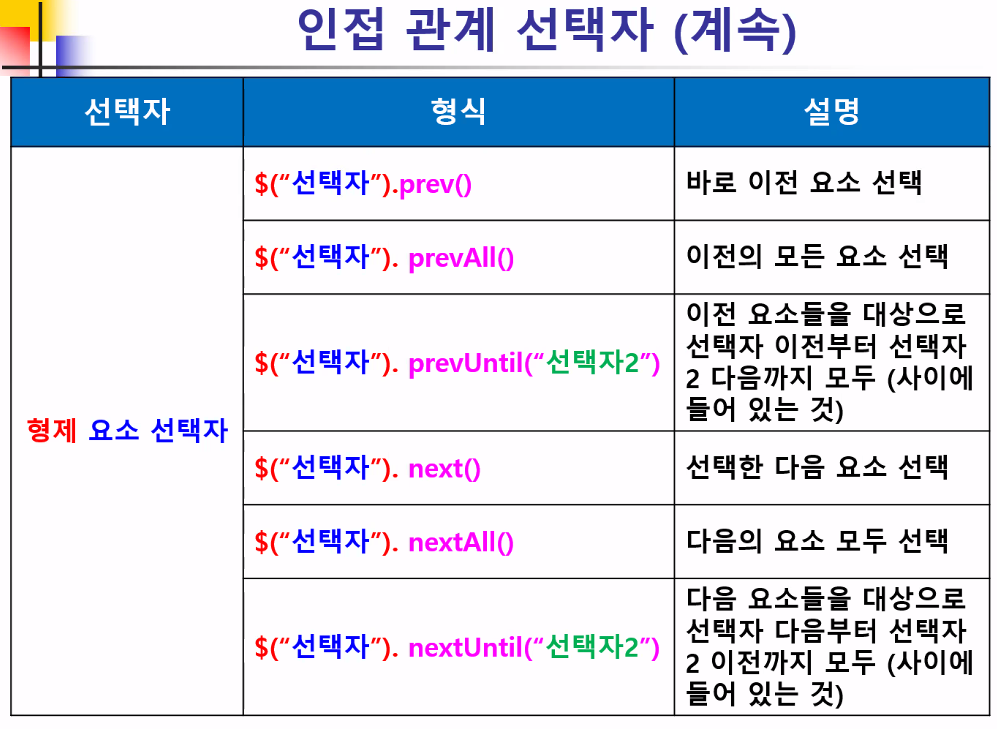
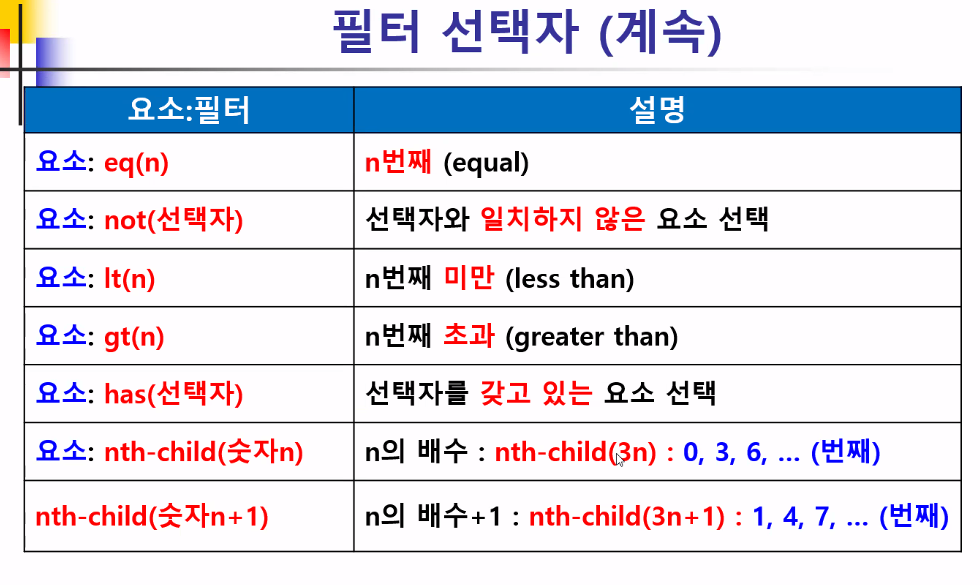
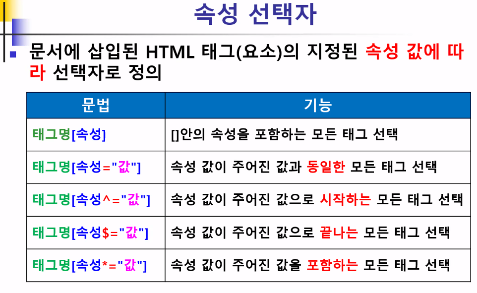

## jQuery

- 다양한 함수들을 모아 놓은 자바스크립트 라이브러리

- 동적으로 HTML이나 CSS 작업 가능
- 여러 메소드를 연결해서 간결한 코딩 가능

## jQuery 개발 환경

- jQery 파일 다운로드 방식
  - 용량이 적기 때문에 jQery 파일을 전달해서 사용하는 방식
- CDN 이용하는 방식
  - 여러 서버를 가지고 있을 경우 링크를 넘겨줘서 접근하는 방식 

## 선택자

