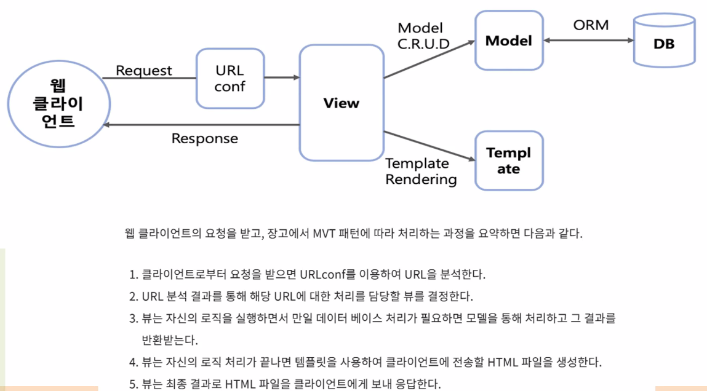
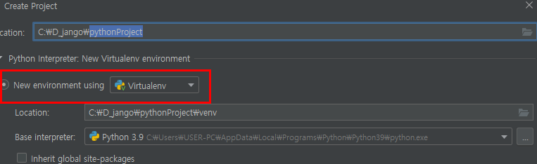
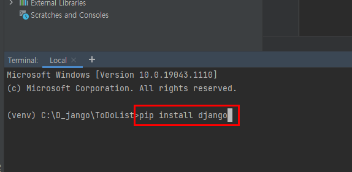
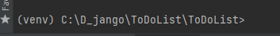
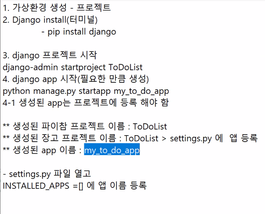
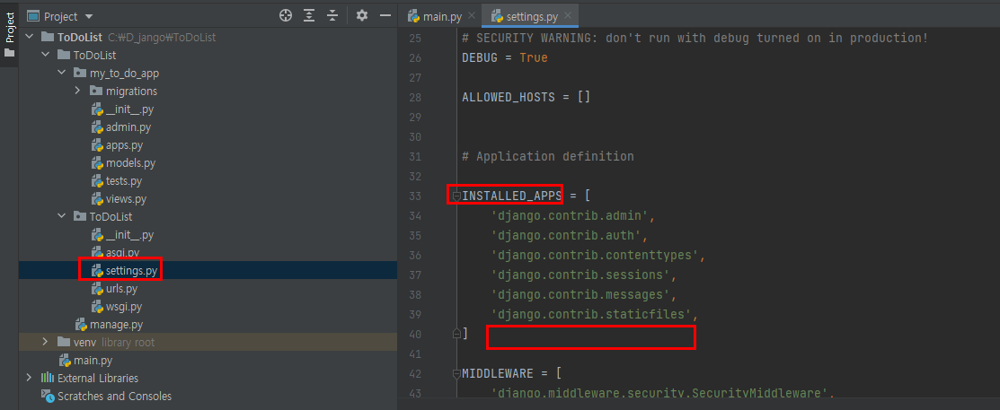
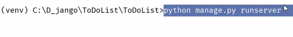
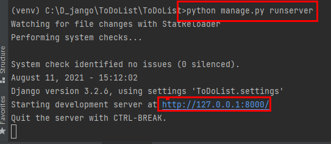
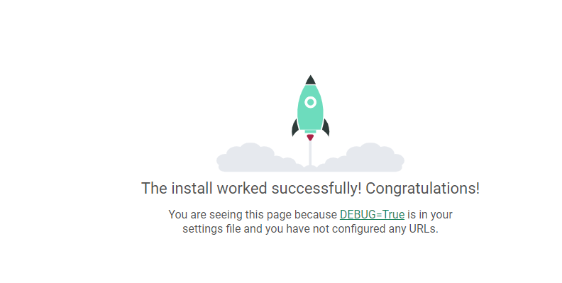

## Django

- Python을 기반으로 작성된 오픈 소스 웹 어플리케이션 프레임워크
  - 프레임워크 : 파이썬  프로그래밍 언어를 기반으로 동적인 웹을 작성해주는 프레임워크

- 웹 개발에 필요한 요소가 내장되어 있음
- MTV 패턴 or MVC 패턴
  - MTV - Model Template View
  - MVC - Model View Controller

## 초기 설정

- 가상환경 인터프리터로 프로젝트 생성
- 가상환경 사용 시 충돌을 막기 위해서 가상환경 사용

- Django 설치

---

## django 프로젝트 시작

- django-admin startproject ToDoList
  - 해당 명령어 터미널에 입력

---

## 경로설정

- 하기 그림 처럼 경로 설정
- dir / cd ToDoList로 변경

---

## django app 시작

- python manage.py startapp my_to_do_app 
  - 해당 명령어 입력

---

## 앱등록

---

## Django migrate 진행

- 데이터베이스에 테이블, 필드 등의 변경이 발생했을 때 지정된 데이터베이스에 적용하는 과정을 의미
- 프로젝트 생성 후 기본 마이그레이션 진행
- python manage.py migrate

## 환경 구성 확인

- python manage.py runserver

