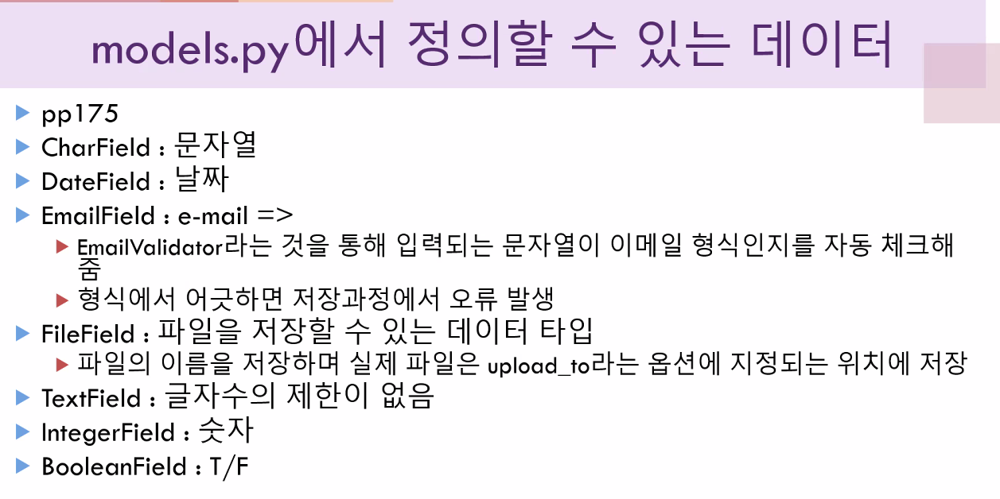

## Django migrate 진행

- 데이터 베이스에 테이블, 필드 등의 변경이 발생했을 때 지정된 데이터 베이스에 적용하는 과정을 의미
- 프로젝트 생성 후 기본 마이크 진행
- python manage.py migrate

## 서버 구동 코드

- 명령어 : python manage.py runserver

## 연결주소

- http://127.0.0.1:8000 = http://localhost:8000
- 현재 개발 중인 컴퓨터에서 프로그램 번호가 8000번인 프로그램으로 요청을 보낼 것

## 프로젝트 개발 순서

1) http://127.0.0.1:8000 으로 클라이언트가 요청하면 브라우저에 index 라는 문구를 츌력
   - url 구성
     - ToDoList.urls.py 파일에서 진행
     - path('', include('my_to_do_app.urls')),

## model.py 정의 내역

